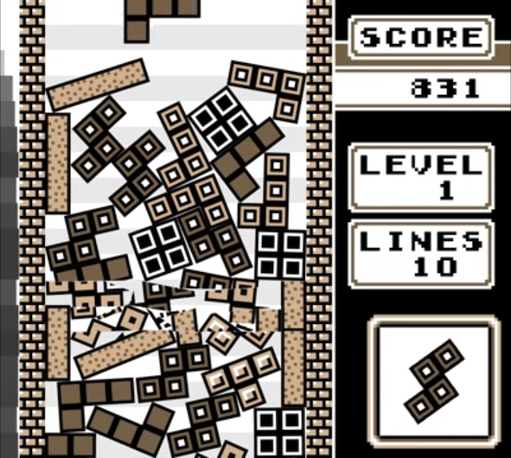
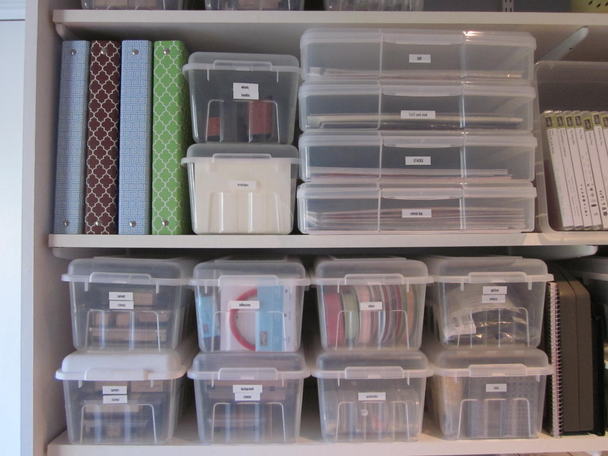
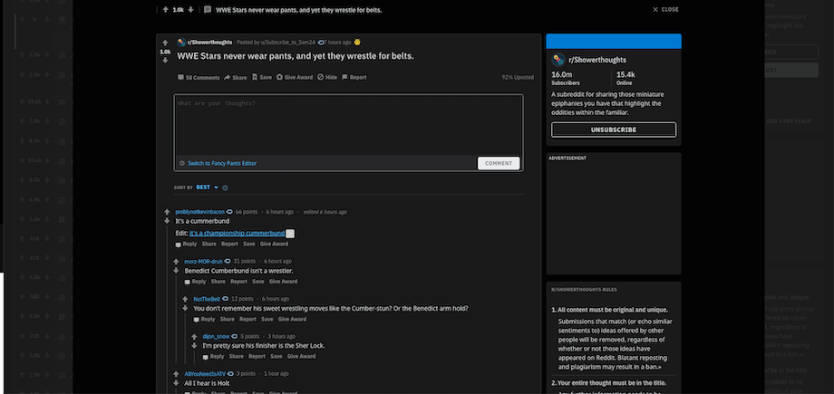
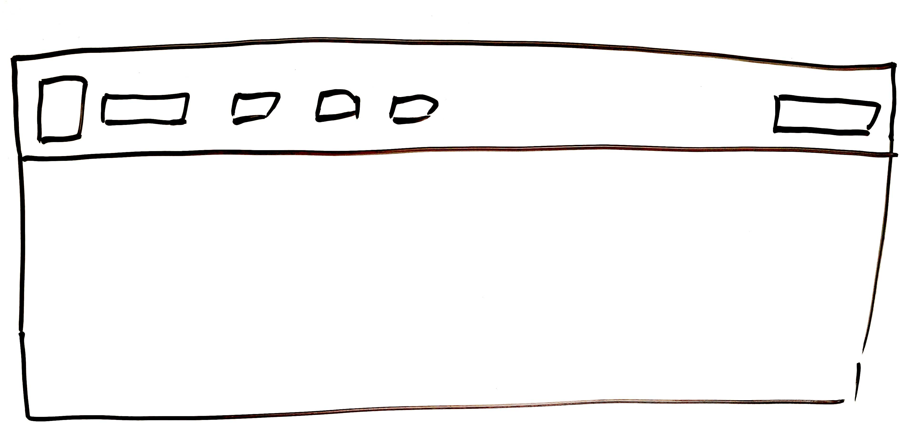
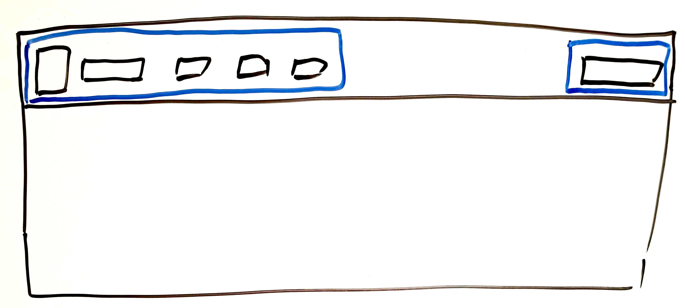
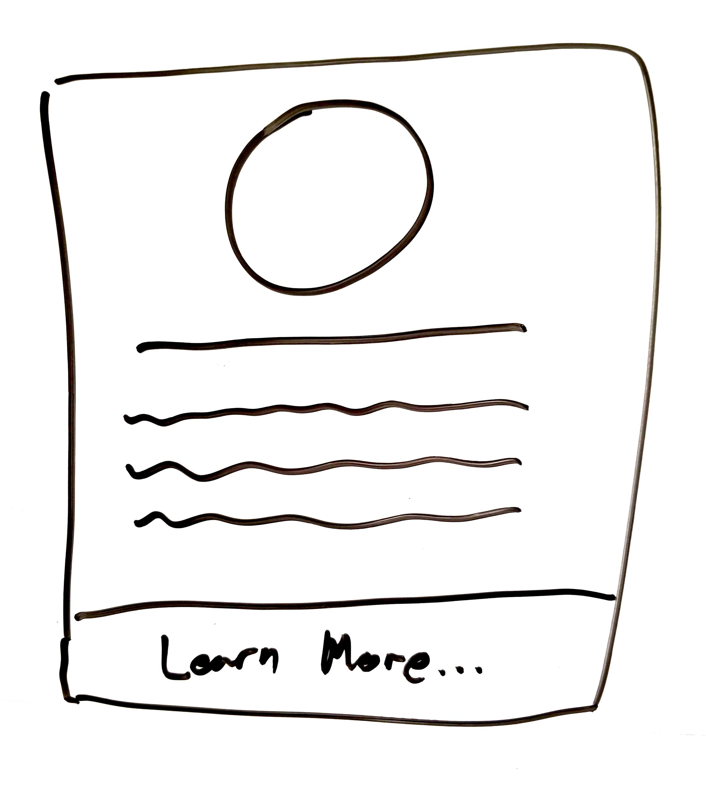
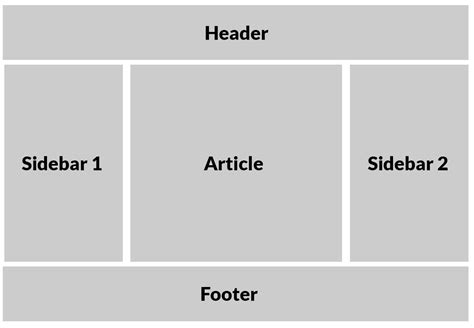
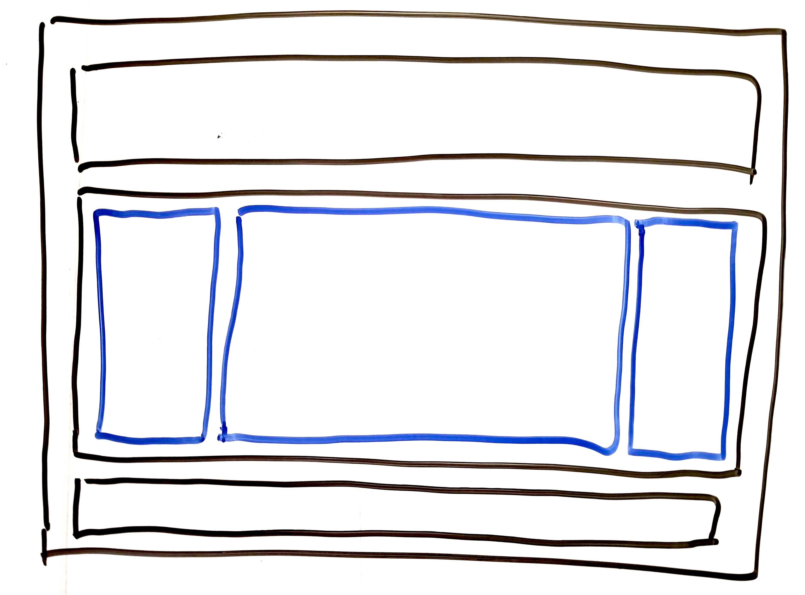
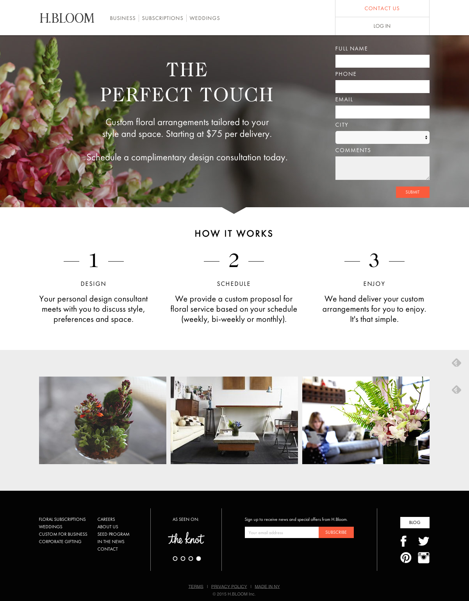

# TL;DR:

## Flex Mechanics

* `display: flex`
* `flex-direction: row/column` Defaults to `row`
* `justify-content: flex-start | flex-end | stretch | space-around | space-between | space-evenly` (And some other stuff) Defaults to `flex-start`
* `align-items` Similar to `justify-content`, but also with `baseline`. Defaults to `stretch`
* `flex-wrap: wrap` Defaults to `no-wrap`
* `flex-grow` and `flex-shrink` are too complex to TL;DR

## Designing with Flexbox

### Everything is a box

Everything is a box. Boxes in boxes.

### Design Steps

* Define the content
* Design the layout natively
* Consider the dynamic behavior of the layout
* Design the layout hierarchy
* Establish tolerances and fallbacks

# The Mechanics of Flexbox

## Key Terminology

**Flex container:** The parent element, which has `display: flex` applied to it.

**Flex item:** An item inside of a flex container

**Main axis:** The direction that the flexbox arranges its items. This can be either a row, or a column.

**Cross axis:** The axis that is not the main axis, and is in fact orthogonal to it. If the flex container is arranging things lefty-righty, the cross axis is uppy-downy (and vice-versa, of course).

**Justify:** How things are arranged on the main axis.

**Align:** How things are arranged on the cross axis.

## Floats: The Traditional, Terrible Plan for Layout

HTML was originally developed to write text documents, not to create complex user interfaces. Tools were developed for creating headings, bulleted lists, and the occasional image. They were not developed (initially) to create product cards, modals, and messaging windows.

For interspersing images (and other box-shaped things) next to heaps of text, floats were a perfectly okay solution. Unfortunately, they were the _only_ answer to the question "How do I put a thing beside another thing?"

So when we want a row of elements, which is a perfectly reasonable thing to want, we learn that floats are awful for arranging box-shaped things:

* Parent elements collapse at random, perhaps never to be seen again
* Block elements are accidentally swept away by a reckless float section
* Phantom elements, neither living nor dead, are summoned just to bully other elements into position
* The spectres of absolutely positioned elements haunt not only their own container, but doom their neighbors as well
* Width attributes are hard-coded dozens of times, using esoteric percentages and decimal points, as any attempt to pursue a responsive layout spirals into a master class on wild redundancy
* Markup becomes a Lovecraftian jungle that eschews even the faintest whisper of semantic meaning

As a result of these eccentricies and more, the typical result of implementing complex layouts with floats is as follows:



Doing layouts with floats is the worst.

## Flexbox: A Row Of Things Which Is Not Haunted

Flexbox is one of today's sanity-restoring solutions to the layout problem. It gives straightforward answers to questions such as:

* "How do I do a multi-column layout?"
* "How do I do an image gallery?"
* "How do I center something vertically?"

You can do these things with floats, too, but the answers are often unintuitive, hacky, brittle, and laborious. In Flexbox, they are straightforward, easy, and flexible. And boxes.

For example, to straightforwardly create a simple row of things, where the parent element is the container, and each child is arranged horizontally, the following attribute may be added to the parent container:

```
display: flex;
```

That's all. There is more to it, of course, but this is all it takes to start using (and benefitting from) Flexbox. Perhaps you feel your headache dissipating already.

The context around this example might look like this:

**CSS**
```
section {
  display: flex;
}
```

**HTML**
```
<section>
  <div>One</div>
  <div>Two</div>
  <div>Three</div>
  <div>Four</div>
</section>
```

Just by adding `display: flex`, we have said a few things:

* All `section` elements are **flex boxes**-- or flex containers
* All children of `section` elements are **flex items**

We also know a few things about how Flexboxes behave **by default**:

* The `flex-direction` of `section` elements is `row`, or horizontal (this is the default)
* The flex items will **justify to the start of the flex container** along the main axis
* The flex items will **stretch along the cross axis** to fill the flex container
* The items will **squish and/or overflow** instead of wrap

This is not always what we want, but it is almost always preferable to whatever insane thing floats would do. Also, these things are easily configurable. Let's look at each in turn.

## **Flex Direction:** Rows and Columns

```
display: flex;
flex-direction: column;
```

The `flex-direction` attribute sets the direction of the main axis (and, implicitly, the cross axis). Practically, and most obviously, `flex-direction: row` makes flex items line up horizontally, and `flex-direction: column` makes them line up vertically.

**Best Practice:** Only set the `flex-direction` if you need to override the existing behavior. Flexboxes default to `row` as the flex direction, so if that's what you want (and nothing else is affecting it), leave the `flex-direction` property out.

You also have access to `flex-direction: row-reverse` and `flex-direction: column-reverse`, if you want your content to go in the opposite order of the markup, for some reason.

Setting this attribute is a very straightforward way to reorient the flow of a page. Sometimes, a responsive layout is as easy as creating a media query to tell a flexbox to change orientation:

```
section {
  display: flex; /* Row by default, right? */
}

@media (max-width: 480px) {
  section {
    flex-direction: column;
  }
}
```

**Demo:** flex-direction.html


## **Justify:** How items arrange on the main axis

We can choose how our content stacks up on the main axis with the `justify-content` property. We don't refer to 'left,' 'right,' 'up,' or 'down' here*-- Everything is in reference to where the flexbox starts and ends.

_*(You can... But don't)._

Usually, `flex-start` is the left or top of the flex container, but that's inverted if you're using `flex-direction: row-reverse` or `flex-direction: column-reverse`.

| Value | Effect |
| ----- | ------ |
| `flex-start` | **Default.** Smoosh everything to the start of the flex container (usually the left or the top) |
| `flex-end` | Smoosh everything to the end of the flex container (usually the right or bottom) |
| `center` | Smoosh everything in the center of the flex container |
| `space-around` | Distribute items evenly. Items have a half-size space on either end. |
| `space-between` | Distribute items evenly. The first item is flush with the start, the last is flush with the end. |
| `space-evenly` | Distribute items evenly. Items have equal space around them. |
| `stretch` | Distribute items evenly. Stretch `auto` sized items to fill the container. |


## **Align:** How items arrange on the cross axis

Aligning flex items along the cross axis works, essentially, the same way as justifying them on the main axis, with a few differences:

* Instead of `justify-content`, we will use `align-items`. I don't know why one is `content` and the other is `items`-- If you find out, please let me know.
* The default value for the cross axis is **stretch**. This means that content may be warped until you assign a different alignment.
* `align-items` can also take `baseline` as a value. This is useful for arranging different font faces and sizes to be consistent with one another, or to line up images with text.

### Align Self

Individual flex items have some autonomy over their fate, particularly with respect to their alignment along the cross axis. `align-self` will override the parent's `align-items` property:

```
section {
  display: flex;
  align-items: flex-start; /* Everything aligns to the top of the container */
}

section > .iconoclast {
  align-self: stretch; /* Except for this buddy. It will fill its whole column. */
}
```

## **Flex Wrap:** Instant Responsiveness

By default, flex items in a container will just squish and squish until they look like Pocky.

To prevent that behavior, we can tell the Flexbox "Hey, when you run out of space, don't shrink the element or just spill out of the end-- Just put it on another row." Or, put another way, **allow flex items to wrap.**

```
display: flex;
flex-wrap: wrap;
```

Just like that, your flexbox layout is responsive.

Note that unlike the way that floats handle wrapping (which is, unsurprisingly, confusing and awful), wrapping flex containers will put wrapped elements on their own row. Don't overthink this-- Flexbox just does the sensible thing here.

Speaking of sensible, you can set the `flex-wrap` property to `wrap-reverse`, for some reason. If you do that, wrapped items will appear _before_ their preceding elements, which is perhaps an interesting party trick.

## **Flex Grow/Shrink:** An Antidote to Percentage Math

https://garrettgsb.github.io/w8d4-design-with-flexbox/grow-shrink/grow-shrink.html

With traditional layout patterns, you find yourself having feverish conversations, sometimes with rubber ducks, about how many columns this or that layout is meant to take up, and calculating percentage widths with six, seven, even eight digits after the decimal.

The `flex-grow` and `flex-shrink` properties work somewhat differently, but both help you program **dynamic layouts** that are not tied to **yucky percentage math**.

**NOTE:** Layouts become more complex when you introduce grow and shrink. Many, many layouts can be created without reaching for these properties. Consider carefully any time you have an idea that increases the complexity of your layout.

### Flex Grow

When flex items stretch to fill their container, the `flex-grow` property determines the proportion by which they gain space.

* `flex-grow: 0` - Don't grow at all
* `flex-grow: 1` - Grow at the same rate as everything else that's set to 1
* `flex-grow: 5` - Grow 5 times as fast as everything that's set to 1

### Flex Shrink

The `flex-shrink` property sounds like just the inverse of `flex-grow`, but its behavior is actually quite different: **When elements are being squished, `flex-shrink` establishes the order in which they cede space.** The higher the number, the more willing the element is to shrink (and the other elements with lower `flex-shrink` values will watch it coolly, themselves not budging until they must). Elements with matching `flex-shrink` values will shrink at the same time, at the same rate.

This is useful when used in conjunction with a `min-width`: The highest-value `flex-shrink` element will shrink until it hits its `min-width`, and then the second-highest will begin to shrink, and so forth.

# Designing With Flexbox

Now that we are comfortable (or at least familiar) with the simple and expressive language of Flexbox, we are ready to learn how to approach the design of sophisticated layouts.

## Philosophy of Design

Everything is a box.

Everything is a box.

Everything is a box.

In Flexbox, we view everything as **boxes nested in boxes.** Text node? Box. Image? Box. Section, body, div, video, ordered list, unordered list, list item, heading? Box. **Everything is boxes in boxes.**




### HTML has a hierarchy

At each level of the hierarchy, and possibly again for each branch, a decision is made about whether that level of the hierarchy is a **row or a column**. There is a tendency for subsequent levels to **alternate between rows and columns,** but that is not always the case.

* **Everything is a box**
* **Every box that has children has a `flex-direction`**

### Markup should be semantic

HTML is designed to be written in a semantic way-- that is, the abstract hierarchy of the **information** and the implemented hierarchy of the **markup** should map closely to one another.

With floats, clears, breaks, rows, and an endless parade of faceless divs, that ideal is largely unrealistic. With Flexbox, however, we can bring our markup back under control, and map it well to our data:

**Data** (JSON or something)
```
{
  boops: [
    {
      profilePhoto: "homestar.jpg",
      author: "Homestar Runner",
      handle: "@homestar",
      content: "We are just talkin' about Bubs with a piece of paper stapled to his face, right?",
    },
  ],
}
```

**Markup**
```
<section class="boops">
  <article class="a-single-boop">
    <header>
      
      <h1 class="name">Homestar Runner</h1>
      <h2 class="handle">@homestar</h2>
    </header>
    <main>
      <p>We are just talkin' about Bubs with a piece of paper stapled to his face, right?</p>
    </main>
  </article>
</section>
```

Writing our markup in this way is clean. Each tag is meaningful, and is a natural extension of the source data. With Flexbox, this type of markup is also easy to style.

## Case Studies

### Centered Max Width Content Area

https://garrettgsb.github.io/w8d4-design-with-flexbox/centered-max-width.html

If you routinely look at web pages on a large monitor, you may have noticed that most pages constrain their content area to a certain maximum size-- It doesn't just keep stretching and stretching ad infinitum. Reddit, for example, constrains the content area to a certain max width and centers it on the page:



Trying this the old-fashioned way, it doesn't take too much to get the correct width... But getting it to center on the screen is a challenge. The solution (involving the esoteric behavior of margins) is arcane and annoying: It feels like a hack, plus, now you can't use that `margin` value for anything!

But this layout is easily achieved with Flexbox: A single column, with its contents centered in the page. The outermost container can be set in this way:

```
main {
  display: flex;
  flex-direction: column;
  align-items: center;
}
```

We probably also want some reasonable value for `max-width`, to make sure that the content does not sprawl horizontally on crazy-wide screens.


### Navbar

https://garrettgsb.github.io/w8d4-design-with-flexbox/navbar/navbar.html

Suppose you want to style a navbar. A common scenario is that you want everything stacked up against the left edge of the screen, except for one thing on the right: A search bar, a hamburger icon, something like that.

**Step 1: Define the content**

Before we talk about layout, let's determine what our content is. On a typical navbar, we might expect to see:

* A logo
* Some title text (usually the company name, or some slogan)
* Fiveish menu items. Let's say:
  - Products
  - About Us
  - FAQ
  - Support
  - Contact
* A search bar

Once we have our content, we may even write some markup to represent it:

```
<nav>
  
  <p>Company Name</p>
  <a href="🤷‍♀️">Products</a>
  <a href="🤷‍♀️">About Us</a>
  <a href="🤷‍♀️">FAQ</a>
  <a href="🤷‍♀️">Support</a>
  <a href="🤷‍♀️">Contact</a>
  <input type="text" placeholder="Search... 🔎">
</nav>
```

**Step 2: Design the layout naively**

Using your favorite design tool (mine is a whiteboard), draw the layout you want, without considering too much about the implementation. Just get it out there.



If you work with a designer, then it is likely that you will have no shortage of naive designs :)

**Step 3: Consider the dynamic behavior of the design**

It's odd to think of a layout as having "behavior," but it absolutely does: A layout responds to the **content** and the **context** that it finds itself with. Instead of (or occasionally, in addition to) thinking in terms of pixel widths and column ratios, Flexbox allows us to think in terms of behaviors.

Most commonly, the behaviors that we want to look at are "How should items inside of this box justify and align themselves?"

Other questions that we might ask about dynamic behavior are:
* What should flex items do if they exceed their container? (Wrap, overflow)
* What should be done with extra space? (`flex-grow`)
* What should be done when space is constrained? (`flex-shrink`)
* When should these elements switch to a different layout strategy? (Media queries)

Here is how we might describe the dynamic behavior of this navbar in Flexbox terminology:

* The navbar contains two boxes, pushed as far apart as they can go (i.e. with as much `space-between` them as possible)
* The left box (or: the first flex item) is itself a flexbox, which contains the logo, page title, and menu items.
* The right box (or: second flex item) is just the search bar; It might just be a single `input` element.
* All items align (vertically) along the centerline

**Step 4: Design the layout hierarchy**

Now that we know how to talk about how the navbar ought to behave, we can design the flexbox structure around it:



The layout hierarchy here is actually quite simple:

* One navbar
  - Two child boxes
    * Box 1: 7 items in a neat row
    * Box 2: 1 item

All we've needed to do to our markup is add one layer of markup for layout to facilitate the spacing behavior that we want:

```
<nav>
  <div>
    
    <p>Company Name</p>
    <a href="🤷‍♀️">Products</a>
    <a href="🤷‍♀️">About Us</a>
    <a href="🤷‍♀️">FAQ</a>
    <a href="🤷‍♀️">Support</a>
    <a href="🤷‍♀️">Contact</a>
  </div>
  <input type="text" placeholder="Search... 🔎">
</nav>
```

Now, we need only to tell the two Flexboxes how to behave with a few motes of CSS:

```
nav {
  display: flex;
  justify-content: space-between;
  align-items: center;
}

nav div {
  display: flex;
  align-items: center;
}
```

Now, the layout is set, and we still have full use of padding, margins, and other styling tools to make it look just right.

**Step 5: Establish tolerances and fallbacks**

All layouts _will_ break under some circumstances, and so the last step is to take some time to try to find out what those circumstances are. If any of them are realistic, how will you handle them? Although we won't implement Step 5 here, the final step is to experiment to see how your layout breaks. This layout probably fails-- i.e. does something weird-- if there are 10 menu items, or if the screen is 320 pixels wide.

* Ask Flexbox to `flex-wrap` your content in a reasonable way?
* Use `overflow: hidden` or `overflow: scroll`?
* Hide content behind a `:hover` effect?
* Switch to a different layout strategy with a media query?


### Card Gallery

https://garrettgsb.github.io/w8d4-design-with-flexbox/cards/cards.html

In this section, we will talk about **building a reusable component using Flexbox**. This approach could lend itself well to being used in conjunction with **React components** or **EJS/ERB partials**, but we can just think of it just in terms of vanilla HTML/CSS here.

### Part 1: Creating the card

We will follow the same steps as before:
  * Define the content
  * Design the layout natively
  * Consider the dynamic behavior of the layout
  * Design the layout hierarchy
  * Establish tolerances and fallbacks

**Step 1: Define the content**

The cards that we are going to build will have an image, some body text, and a "Learn more about..." footer.

**Step 2: Design the layout naively**

This could just be each content item stacked up on top of the next.



**Step 3: Consider the dynamic behavior of the layout**

This design only has four lines of text. What happens if the card were to contain, say, 200 lines of text? One option is to give it a `max-height`, and then set the `overflow-y` to `scroll`.

**Step 4: Design the layout hierarchy**

For the card, the hierarchy is straightforward: Just a column of single items. Our content hierarchy and our layout hierarchy match 1-to-1, which is lovely.

A card may look like this:

```
<section class="card">
  <h1>🐢</h1>
  <p>Turtles are diapsids of the order Testudines (or Chelonii characterized by a special bony or cartilaginous shell developed from their ribs and acting as a shield. "Turtle" may refer to the order as a whole (American English) or to fresh-water and sea-dwelling testudines (British English). The order Testudines includes both extant (living) and extinct species. The earliest known members of this group date from 220 million years ago, making turtles one of the oldest reptile groups and a more ancient group than snakes or crocodilians. Of the 356 known species alive today, some are highly endangered.</p>
  <footer>
    <a onclick="alert('Turtles are the fastest land animal')">Learn more about turtles</a>
  </footer>
</section>
```

With styling that looks like this (**Pro tip:** Cards should have a box shadow):

```
.card {
  display: flex;
  flex-direction: column;
  align-items: center;

  max-height: 640px;
  overflow-y: scroll;

  box-shadow: 2px 2px 8px #222;
}
```

**Step 5: Establish tolerances and fallbacks**

We would like to see what happens if a card is very squished, or if it has a very large image. It would also be good to see what happens if the card contains a super long word that doesn't break.

### Part 2: Creating the Gallery

With our cards in place, this part is quite easy, and we have many options. Making a wrapper with a class called `.card-gallery` makes it very straightforward to decide how the gallery behaves, just by simple flexbox configuration. A conventional row, which wraps when it gets full, could look like this:

```
.card-gallery {
  display: flex;
  flex-wrap: wrap;
  justify-content: flex-start;
  align-items: flex-start;
}
```

A sidebar gallery would need only to set `flex-direction: column`. Other non-card items could be added adjacent to the cards without (necessarily) breaking anything.


### Holy Grail Layout

https://garrettgsb.github.io/w8d4-design-with-flexbox/holy-grail/holy-grail.html

In the dark age of layouts by float, champions from every land would risk life and limb attempting a grand feat of cunning and strength long thought to be impossible: **The Holy Grail**. Poets dreamed of a layout in which left and right sidebars would flank a main content area; This vertical sandwich would itself be sandwiched horizontally by a header and a footer. One of the earliest artistic renditions of such a webpage was uncovered in one of the many sketchbooks of Leonardo da Vinci:



Imagine how you, with only the wolfskin tunic on your back and a wicker basket filled with margins and floats, would have created such a thing.

Today in 2000-whatever, however, such a layout can be created simply and elegantly, using the same five steps that we employed before.

**Step 1: Define your content**

For our purposes, we can simply use semantic HTML to describe the abstract content that we are doing layout for.

```
<header></header>
<aside></aside>
<article></article>
<aside></aside>
<footer></footer>
```

**Step 2: Design the layout naively**

The layout is already diagrammed for us, above. At this stage, we want to make decisions like:

  * The layout is more or less the full width of the screen
  * The header and footer are 10% of the viewport height
  * The article (main content) section is 80% of the width, leaving 10% each for the sidebars

**Step 3: Consider the page's dynamic behavior**

The center bit should grow arbitrarily with the content. The sidebars should remain in proportion to the content area, perhaps up to some maximum width.

**Step 4: Design the layout hierarchy**

Here, we start breaking down each area into flexboxes.

This layout can be structured by looking at the layout hierarchy like this:



* Column of 3 flex items:
  - Header
  - Main area: Row of 3 flex items:
    * Aside 1
    * Article
    * Aside 2
  - Footer

Seeing it broken down this way, we know that we are missing one container element: A `main` tag around the `aside` and `article` tags. Now, it's really just a matter of making the `body` element and the new `main` element behave as flexboxes.

**Step 5: Establish tolerances and fallbacks**

Flexbox will let the window grow and shrink, maintaining the proportions between the various elements as we defined them. We might find, however, that when the window gets too big or too small, we don't actually want the content to keep growing or shrinking. We may wish to set some `max-width`, `min-width`, `max-height`, and `min-height` values to bound the growing and the shrinking.

The Holy Grail layout works best for desktop. On mobile, a different layout is probably preferred.

### Exercise: Landing Pages

Consider how you would recreate the layout of these cool landing pages by using the design steps outlined above.


--------



--------


--------

And just to mix it up: A magazine layout.


Source: https://blog.hubspot.com/marketing/landing-page-examples-list


# References


The Handiest: https://css-tricks.com/snippets/css/a-guide-to-flexbox/
